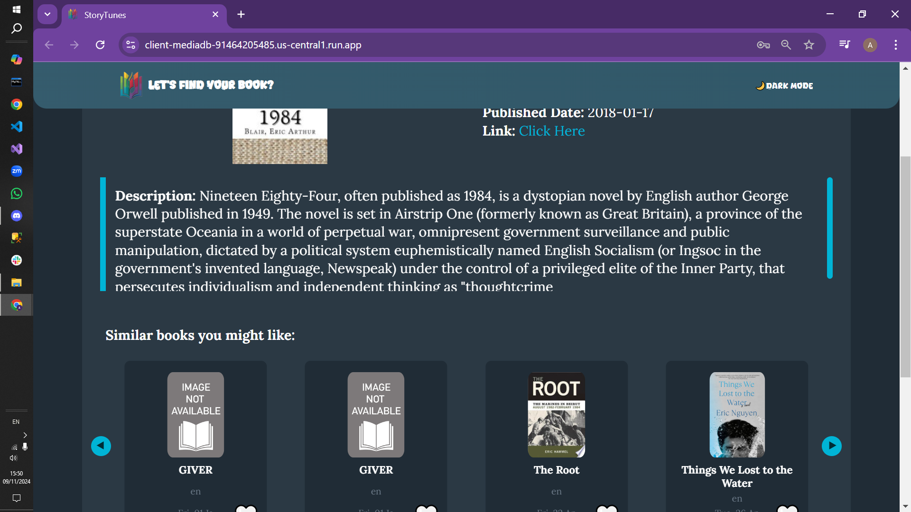

# [Story Tunes](https://client-mediadb-91464205485.us-central1.run.app)
A full-stack project, made to practice integration between a client, a server and a data base, and to practice deploying an app available freely on the web.

## Features:
-Searching and viewing data about books and songs stored at our database.

-User authentication and personal favorites tracking.

-Viewing and searching in the personal favorites section.

-Machine learning driven book recommendations.

## Challenges:
We both have different paces of development. As this is a practice project, letting Yaniv go ahead and finish everything himself would be counterproductive, and so we have taken two measures to avoid it.

1. Working together via discord screen sharing. At all times one of us would actually program and the other   would think and suggest different ideas. We switched often to make sure both of us were involved in most things.

2. Duplicating features. This allowed each of us to practice independently the same concepts.

## Gallery:

<table style="width:100%; border-collapse:collapse;">
  <tr>
    <td style="text-align:center;">
        
    </td>
    <td style="text-align:center;">
        
    </td>
  </tr>
    <tr>
    <td style="text-align:center;">
        
    </td>
    <td style="text-align:center;">
        
    </td>
  </tr>
    <tr>
    <td style="text-align:center;">
        
    </td>
    <td style="text-align:center;">
        
    </td>
  </tr>
</table>

## Key Takeaways and Future Improvements:
Without defined standards for component structure and interface, our front-end development process was less efficient. Yaniv and Amit worked independently on the books and songs sections, respectively, resulting in duplicated components that could have been shared.

To streamline future projects, we should prioritize creating a unified component library with clear guidelines for their design and behavior.

## Stack:
Front-end:
React
Java Script
CSS

Back-end:
Node.js
MongoDB Atlas

Deployment:
Docker
Google Cloud Platform (GCP)

## Contributors
- [Yaniv Ridel](https://github.com/Yanivridel)
- [Amit Kubani](https://github.com/AgitAgit)
