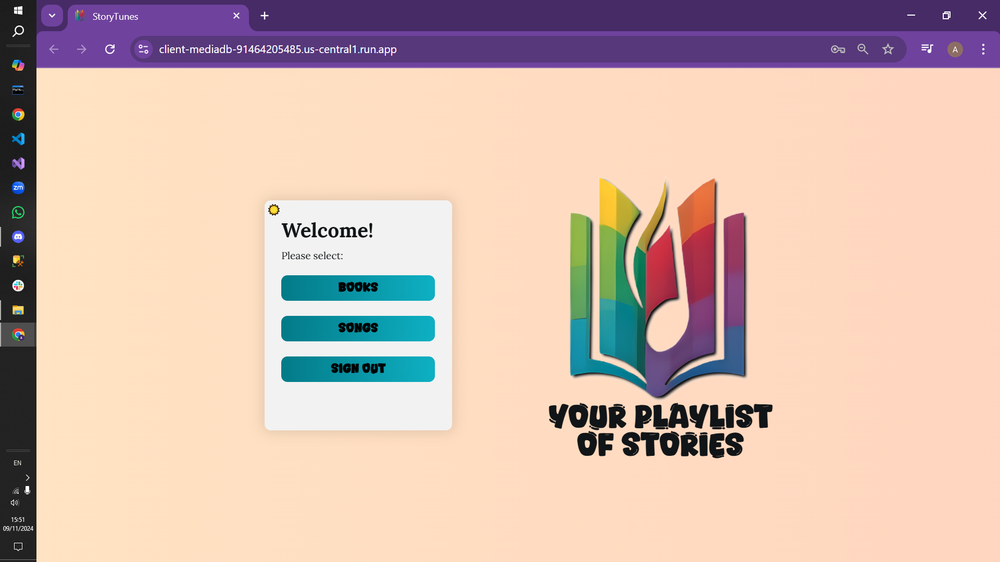
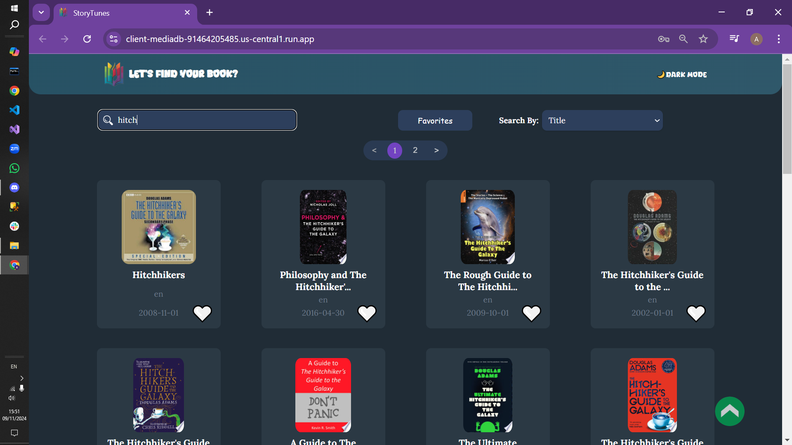
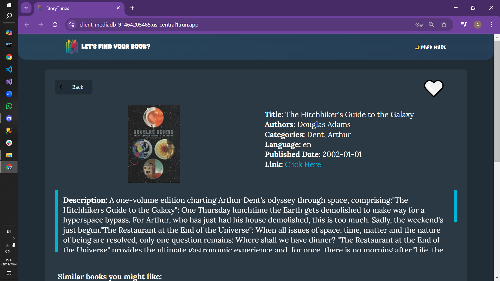
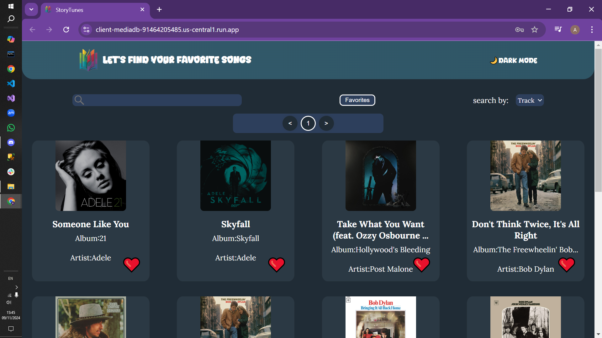
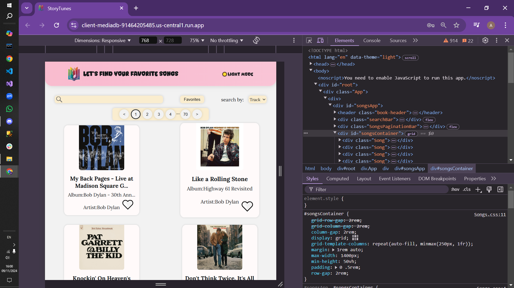

# [Story Tunes](https://client-mediadb-91464205485.us-central1.run.app)
A full-stack project, made to practice integration between a client, a server and a data base, and to practice deploying an app available freely on the web.

## Features:
-Searching and viewing data about books and songs stored at our database.

-User authentication and personal favorites tracking.

-Viewing and searching in the personal favorites section.

-Machine learning driven book recommendations.

## Challenges:

## Gallery:

## Lessons and ideas for similar future projects:

## Stack:
Front-end:
React
Java Script
CSS

Back-end:
Node.js
MongoDB Atlas

Deployment:
Docker
Google Cloud Platform (GCP)

## Contributors
- [Yaniv Ridel](https://github.com/Yanivridel)
- [Amit Kubani](https://github.com/AgitAgit)
